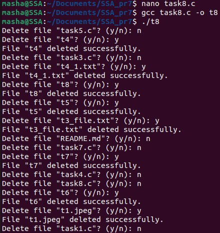

## Задача 1

### Текст завдання
Використайте popen(), щоб передати вивід команди rwho (команда UNIX) до more (команда UNIX) у програмі на C.
### *Реазілація*
>$sudo apt install rwho

Команда /usr/bin/rwho відображає ім’я користувача, ім’я хоста, а також дату й час початку кожного сеансу для всіх у локальній мережі, які зараз увійшли до хосту, на якому запущено демон rwhod.
_______
## Задача 2

### Текст завдання
 Напишіть програму мовою C, яка імітує команду ls -l в UNIX — виводить список усіх файлів у поточному каталозі та перелічує права доступу тощо.
 (Варіант вирішення, що просто виконує ls -l із вашої програми, — не підходить.)
### *Реазілація*

_______
## Задача 3

### Текст завдання
Напишіть програму, яка друкує рядки з файлу, що містять слово, передане як аргумент програми (проста версія утиліти grep в UNIX).
### *Реазілація*

Шляхом перевірки кожного рядка(масиву довжиною 1024 символи) за допомого функції strstr(), що повертає вказівник на позицію першого входження рядка в інший рядок, знаходимо рядок і виводимо його.

_______

## Задача 4

### Текст завдання
Напишіть програму, яка виводить список файлів, заданих у вигляді аргументів, з зупинкою кожні 20 рядків, доки не буде натиснута клавіша (спрощена версія утиліти more в UNIX).
### *Реазілація*

по черзі зчитуємо рядки в кожному файлі із розширенням txt та виводимо 20 рядків за одну ітерацію, поки не натиснуто Enter

_______
## Задача 5

### Текст завдання
 Напишіть програму, яка перелічує всі файли в поточному каталозі та всі файли в підкаталогах.
### *Реазілація*

Я використала getcwd() для отримання поточного каталогу замість ".". Формування шляхів виконується через snprintf(), а рекурсія забезпечує обхід усіх підкаталогів. Це робить програму гнучкішою та незалежною від початкової точки запуску.
_______
## Задача 6

### Текст завдання
 Напишіть програму, яка перелічує лише підкаталоги у алфавітному порядку.
### *Реазілація*

Програма перелічує лише підкаталоги у поточному каталозі, але щоб зробити її зручною, потрібно було сортувати каталоги за алфавітом. Спочатку я використала dirent.h для зчитування вмісту каталогу, а потім stat() із sys/stat.h, щоб перевіряти, чи елемент є підкаталогом. Знайдені назви я зберігала у масиві, а qsort() із string.h допоміг відсортувати їх у правильному порядку.
_______
## Задача 7

### Текст завдання
Напишіть програму, яка показує користувачу всі його/її вихідні програми на C, а потім в інтерактивному режимі запитує, чи потрібно надати іншим дозвіл на читання (read permission); у разі ствердної відповіді — такий дозвіл повинен бути наданий.
### *Реазілація*

Шукаємо усі файли із розширенням *.с та виводимо їх. У випадку схваленням користувачем пропозицію надати доступ усім користувачам доступу, виконується функція *change_permissions(const char *filename)*, що функцією chmod(filename, S_IRUSR | S_IRGRP | S_IROTH) міняє права доступу. Можемо це бачити на зображенні.
_______
## Задача 8

### Текст завдання
 Напишіть програму, яка надає користувачу можливість видалити будь-який або всі файли у поточному робочому каталозі. Має з’являтися ім’я файлу з запитом, чи слід його видалити.
### *Реазілація*

Ітеративно зчитуємо файли в каталозі, та питаємо користувача чи потрібно їх видалити. 'Y' => remove(filename).Відповідала у на екзешники та зображення.Перевіряємо результат комадною ls. Все працює коректно.

_______
## Задача 9

### Текст завдання
 Напишіть програму на C, яка вимірює час виконання фрагмента коду в мілісекундах
### *Реазілація*

Вираховуємо різницю у часі перед заходу в цикл та після.
_______
## Задача 10

### Текст завдання
Напишіть програму мовою C для створення послідовності випадкових чисел з плаваючою комою у діапазонах:
 (a) від 0.0 до 1.0
 (b) від 0.0 до n, де n — будь-яке дійсне число з плаваючою точкою.
 Початкове значення генератора випадкових чисел має бути встановлене так, щоб гарантувати унікальну послідовність.
Примітка: використання прапорця -Wall під час компіляції є обов’язковим.

### *Реазілація*

_______

## Задача по варіанту 9

### Текст завдання
Розробіть сканер портів у локальній мережі, який не використовує сокети або будь-які мережеві бібліотеки напряму.
### *Реазілація*

_______
